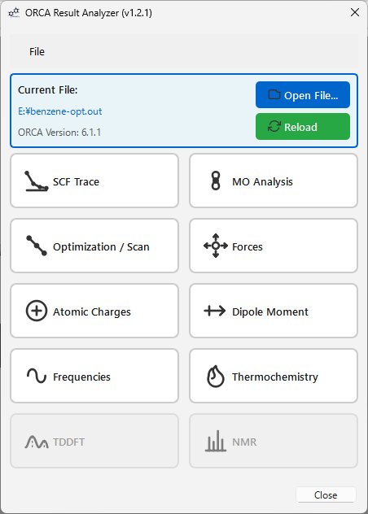
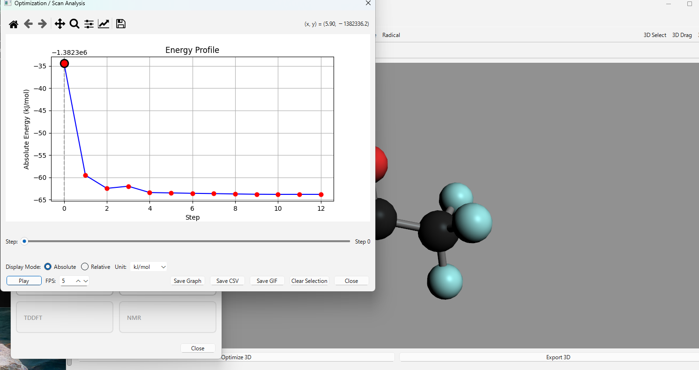
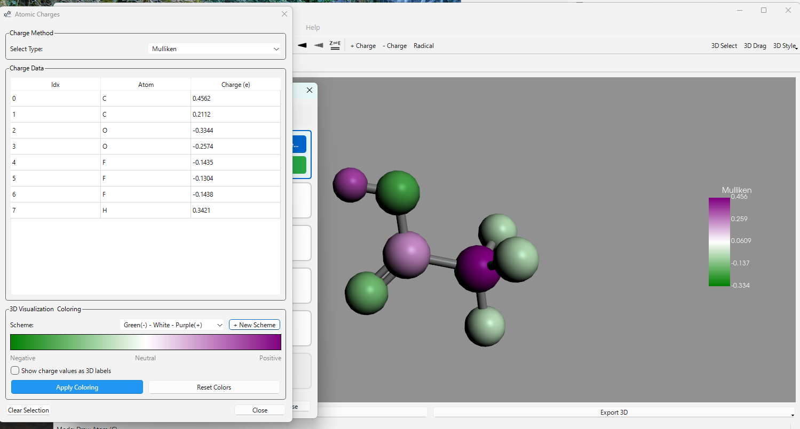
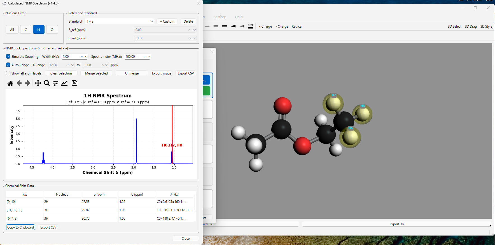

# MoleditPy ORCA Result Analyzer — Rust Edition

A high-performance fork of the ORCA Result Analyzer plugin for MoleditPy.
The parser is rewritten in Rust for significantly faster parsing of large ORCA output files.
All GUI and analysis features are identical to the original plugin.



## Why Rust?

The original parser performs 14+ full passes over the file in Python.
For large ORCA outputs (geometry optimizations, NEB paths, frequency calculations)
this can take several seconds.  The Rust parser completes the same work in a single
compiled pass — typically **10–50× faster** for large files.

| File size | Python parser | Rust parser |
|---|---|---|
| ~5 000 lines (single-point) | ~0.05 s | ~0.003 s |
| ~50 000 lines (opt + freq) | ~0.5 s | ~0.02 s |
| ~500 000 lines (large NEB) | ~5 s | ~0.15 s |

## Build (required before first use)

```bash
# 1. Install the Rust toolchain (one-time, if not already installed)
#    https://rustup.rs/

# 2. Install maturin (one-time)
pip install maturin

# 3. Build and copy the extension in-place (no virtualenv needed)
python build.py

# 4. Or build an optimised release binary (slower compile, faster runtime)
python build.py --release

# 5. Or just produce a wheel in build/ without copying in-place
python build.py --wheel
```

The script uses `maturin build` internally (no virtualenv required), then
extracts and copies `orca_parser_rs.pyd` (Windows) / `orca_parser_rs.so`
(Linux/macOS) directly into `orca_result_analyzer_rust/`.
That file is listed in `.gitignore` and should not be committed.

## Installation as a MoleditPy plugin

Place the entire `orca_result_analyzer_rust/` folder in your MoleditPy plugins directory
**after** running `python build.py`.  MoleditPy discovers it automatically on startup.

## Features

### 1. SCF Trace
Real-time convergence visualization for SCF energy cycles.
- **Concatenated View**: View a single continuous plot of all SCF cycles throughout the calculation.
- **Interactive Tools**: Full zoom, pan, and save support via an integrated Matplotlib toolbar.

### 2. MO Analysis
- **Levels**: View orbital energies and occupancy with HOMO/LUMO identification.
- **Visualization**: Generate 3D Cubes (isosurfaces) with **Smooth Shading** and adjustable opacity.
- **Presets**: Save and manage visualization presets (colors, isovalues, styles).
- **Advanced Support**: Successfully handles S, P, D, F, and G shells (L=4).


### 3. Optimization / Scan
Analyze **Geometry Optimizations** and **Relaxed Surface Scans**.
- **Interactive Graph**: Plot Energy vs. Step. Click points to update the 3D structure.
- **Display Modes**: Toggle between **Absolute** and **Relative** energy (kJ/mol, kcal/mol, eV, Eh).
- **Log Scale**: Supports log-scale visualization for relative energy changes.
- **Animation**: Play/Pause trajectory animations with adjustable FPS.
- **Export**: Save plots as images or export the full 3D animation as high-quality **GIFs**.



### 4. Forces
Analyze structural forces for the current structure or the entire trajectory.
- **Historical Gradients**: Capture and display force vectors for **every** step of an optimization or scan.
- **Visualization Controls**: Auto Scale for vector size, step-by-step navigation.
- **Convergence Tracking**: Multi-line display of RMS/MAX Gradient and RMS/MAX Step, color-coded.

### 5. Atomic Charges
- **Populations**: Mulliken, Loewdin, Hirshfeld, NBO, CHELPG, MK, MBIS, RESP, FMO.
- **3D Coloring**: Color atoms in the 3D viewer based on charge value.



### 6. Dipole Moment
- **Vector Visualization**: Display the total dipole moment vector in the 3D viewer.

### 7. Frequencies
Visualize vibrational modes and spectra.
- **IR/Raman**: Stick and broadened spectra with interactive peak labels.
- **Visualization**: Animated vibrational modes with vector arrows.


### 8. Thermochemistry
- Electronic Energy, ZPE, Enthalpy (H), Gibbs Free Energy (G).
- Detailed breakdown of vibrational, rotational, and translational contributions.

### 9. TDDFT
- **Absorption** and **CD** spectra with Gaussian broadening.
- Length and Velocity gauge support.

### 10. NMR
- Nucleus-specific stick spectra with experimental reference standards.
- J-coupling multiplet simulation.
- Custom reference management and equivalent-atom merging.



## Requirements

- **MoleditPy** (main application)
- **Rust toolchain** + **maturin** (build-time only)
- **Runtime Python deps**: `PyQt6`, `rdkit`, `matplotlib`, `Pillow`, `pyvista`
- **Optional**: `nmrsim` (for J-coupling simulation)

## Required ORCA Keywords

**For MO Cube Generation:**
```
%output
  Print[P_Basis] 2
  Print[P_Mos] 1
end
```

**For NMR Simulation (J-Coupling):**
```
! NMR
%eprnmr
  NUCLEI = ALL H {SHIFT, SSALL}
end
```

## Repository structure

```
moleditpy_orca_result_analyzer_rust/
├── Cargo.toml               Rust package manifest
├── pyproject.toml           maturin build config (not for PyPI)
├── build.py                 Build script
├── src/
│   └── lib.rs               Rust parser (~800 lines, PyO3 bindings)
└── orca_result_analyzer_rust/
    ├── __init__.py          Plugin entry point
    ├── parser.py            Thin Python wrapper — delegates to Rust
    └── *.py                 GUI and analysis modules (unchanged)
```
